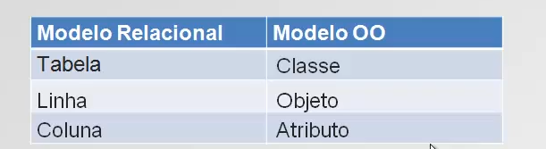

# Curso JPA e Hibernate além do básico - um projeto completo


---

## <a name="indice">Índice</a>

- [1. Introdução](#parte1)   
- [2. Iniciando com JPA 2](#parte2)   
- [3. Preparando o ambiente](#parte3)   
- [4. Mapeamento Objeto-Relacional](#parte4)   
- [5. Conceitos e mapeamentos avançados - parte 1](#parte5)   
- [6. Trabalhando com consultas](#parte6)   
- [7. Conhecendo mais sobre o Entity Manager](#parte7)   
- [8. Consultas com Criteria](#parte8)   
- [9. Gravação e exclusão em cascata](#parte9)   
- [10. Conceitos e mapeamentos avançados - parte 2](#parte10)   
- [11. Outros detalhes importantes](#parte11)   


---

## <a name="parte1">1. Introdução</a>

#### v1.3-instalando-o-mysql-v1

- https://dev.mysql.com/downloads/

#### v1.5-criando-primeiras-tabelas-no-mysql-v1

```sql
# algawork_jpahibernate_cadclientes

CREATE TABLE cliente (
  codigo BIGINT NOT NULL AUTO_INCREMENT,
  nome VARCHAR(100) NOT NULL,
  idade INTEGER,
  sexo VARCHAR(1) NOT NULL,
  profissao VARCHAR(30),
  PRIMARY KEY (codigo)
);

insert into cliente(nome, idade, sexo, profissao) values("Jose", 34, "M", "Analista de sistemas");
insert into cliente(nome, idade, sexo, profissao) values("Maria", 24, "F", "Analista contabil");
insert into cliente(nome, idade, sexo, profissao) values("Marcia", 26, "F", "Administradora");
insert into cliente(nome, idade, sexo, profissao) values("Caio", 46, "M", "Engenheiro");
```

#### v1.6-mapeamento-objeto-relacional-v1



#### v1.7-relacionamento-entre-tabelas-v1

```sql
CREATE TABLE conta_corrente (
  codigo BIGINT NOT NULL AUTO_INCREMENT,
  numero VARCHAR(12) NOT NULL,
  saldo DECIMAL,
  codigo_cliente BIGINT NOT NULL,
  PRIMARY KEY (codigo),
  FOREIGN KEY (codigo_cliente) REFERENCES cliente (codigo)
);

insert into conta_corrente(numero, saldo, codigo_cliente) values( 448888, 120.00, 2);

select cli.nome,cc.saldo
from cliente cli, conta_corrente cc
where cli.codigo = cc.codigo_cliente

```

#### v1.8-instalando-e-configurando-o-eclipse-v1
 
- https://www.eclipse.org/downloads/

#### v1.9-download-e-configuracao-do-hibernate-v1

- http://hibernate.org/
 
#### v1.10-download-e-configuracao-do-driver-mysql-v1

- https://dev.mysql.com/downloads/connector/j/5.1.html

[Voltar ao Índice](#indice)

---

## <a name="parte2">2. Iniciando com JPA 2</a>

#### v2.1-salvando-o-primeiro-objeto-no-banco-de-dados-v1

```xml
<?xml version="1.0" encoding="UTF-8"?>
<persistence version="2.0"
	xmlns="http://java.sun.com/xml/ns/persistence" xmlns:xsi="http://www.w3.org/2001/XMLSchema-instance"
	xsi:schemaLocation="http://java.sun.com/xml/ns/persistence http://java.sun.com/xml/ns/persistence/persistence_2_0.xsd">
	
	<persistence-unit name="exemploPU" transaction-type="RESOURCE_LOCAL">
		
		<properties>
			<property name="javax.persistence.jdbc.url" value="jdbc:mysql://localhost:3306/algawork_jpahibernate_cadclientes"/>
			<property name="javax.persistence.jdbc.user" value="root"/>
			<property name="javax.persistence.jdbc.password" value=""/>
			<property name="javax.persistence.jdbc.driver" value="com.mysql.jdbc.Driver"/>
			
			<!-- validate | update | create | create-drop -->
			<property name="hibernate.hbm2ddl.auto" value="update"/>
            <property name="hibernate.dialect" value="org.hibernate.dialect.MySQLDialect"/>
		</properties>
	
	</persistence-unit>
	
</persistence>
```

```java
package com.algaworks.curso.modelo;

import javax.persistence.Entity;
import javax.persistence.GeneratedValue;
import javax.persistence.GenerationType;
import javax.persistence.Id;

@Entity
public class Cliente {
	
	@Id
	@GeneratedValue(strategy=GenerationType.IDENTITY)
	private Long codigo;
	private String nome;
	private Integer idade;
	private String sexo;
	private String profissao;
	public Long getCodigo() {
		return codigo;
	}
	public void setCodigo(Long codigo) {
		this.codigo = codigo;
	}
	public String getNome() {
		return nome;
	}
	public void setNome(String nome) {
		this.nome = nome;
	}
	public Integer getIdade() {
		return idade;
	}
	public void setIdade(Integer idade) {
		this.idade = idade;
	}
	public String getSexo() {
		return sexo;
	}
	public void setSexo(String sexo) {
		this.sexo = sexo;
	}
	public String getProfissao() {
		return profissao;
	}
	public void setProfissao(String profissao) {
		this.profissao = profissao;
	}
	
	
}

```

```java
package com.algaworks.curso.main;

import javax.persistence.EntityManager;
import javax.persistence.EntityManagerFactory;
import javax.persistence.Persistence;

import com.algaworks.curso.modelo.Cliente;

public class SalvandoPrimeiroObjeto {

	public static void main(String[] args) {
		
		EntityManagerFactory emf = Persistence.createEntityManagerFactory("exemploPU");
		EntityManager em = emf.createEntityManager();
		
		Cliente cliente = new Cliente();
		cliente.setNome("Maria joaquina");
		cliente.setIdade(22);
		cliente.setProfissao("Atriz");
		cliente.setSexo("F");
		
		
		em.getTransaction().begin();
		em.persist(cliente);
		em.getTransaction().commit();
		
		System.out.println("Cliente Salvo com sucesso");
		//em.close();
	}

}

```

#### v2.2-primeira-consulta-com-jpa-v1

```java
package com.algaworks.curso.main;

import javax.persistence.EntityManager;
import javax.persistence.EntityManagerFactory;
import javax.persistence.Persistence;

import com.algaworks.curso.modelo.Cliente;

public class ConsultandoPrimeiroObjeto {
	public static void main(String[] args) {
		EntityManagerFactory emf = Persistence.createEntityManagerFactory("exemploPU");
		EntityManager em = emf.createEntityManager();
		
		Cliente cliente = em.find(Cliente.class, 10L);
		
		if(cliente != null) {
			System.out.println("Nome: "+ cliente.getNome());
			System.out.println("Nome: "+ cliente.getProfissao());
			System.out.println("Nome: "+ cliente.getSexo());
			System.out.println("Nome: "+ cliente.getIdade());
		}else {
			System.out.println("Cliente não existe!");
		}
		
	}

}

```


#### v2.3-removendo-objeto-do-banco-de-dados-v1

```java
package com.algaworks.curso.main;

import javax.persistence.EntityManager;
import javax.persistence.EntityManagerFactory;
import javax.persistence.Persistence;

import com.algaworks.curso.modelo.Cliente;

public class RemovendoPrimeiroObjeto {

	public static void main(String[] args) {

		EntityManagerFactory emf = Persistence.createEntityManagerFactory("exemploPU");
		EntityManager em = emf.createEntityManager();
		
		Cliente cliente = em.find(Cliente.class, 5L);
		
		em.getTransaction().begin();
		em.remove(cliente);
		em.getTransaction().commit();
		
		System.out.println("Objeto removido com sucesso");

	}

}

```

#### v2.4-atualizando-o-banco-de-dados-v1

```java
package com.algaworks.curso.main;

import javax.persistence.EntityManager;
import javax.persistence.EntityManagerFactory;
import javax.persistence.Persistence;

import com.algaworks.curso.modelo.Cliente;

public class AtualizandoPrimeiroObjeto {

	public static void main(String[] args) {

		EntityManagerFactory emf = Persistence.createEntityManagerFactory("exemploPU");
		EntityManager em = emf.createEntityManager();
		
		Cliente cliente = em.find(Cliente.class, 1L);
		
		em.getTransaction().begin();
		cliente.setNome("José Malcher JUNIOR");
		cliente.setIdade(35);
		em.getTransaction().commit();
		
		System.out.println("Cliente alterado com sucesso!");
		

	}

}

```

#### v2.5. Fazendo seu primeiro CRUD

Está na hora de você criar seu primeiro CRUD depois de ter assistido essa pequena introdução.

Para isso você irá fazer outro projeto, bem parecido com o que fizemos nas últimas vídeo aulas mas, será que você consegue fazê-lo sozinho e com algum "plus"?

Crie um novo projeto para já ir se acostumando com o que você precisa para fazer configurar ao criar um novo projeto com JPA e conexão ao MySQL. Chame-o de agenda-telefonica.

Crie um modelo como o mostrado na classe abaixo.


 
Dica: Para o mapeamento utilize @Temporal(TemporalType.TIMESTAMP) para o atributo do tipo data (java.util.Date). Nós iremos ver mais detalhes sobre essa anotação, agora é só para você sentir um gostinho!

Crie então 4 classes para fazer o CRUD (Create, Retrieve, Update e Delete - Salvar, Consultar, Atualizar e Remover) no banco de dados como fizemos nas últimas vídeo aulas.


#### v2.6-entendendo-um-pouco-mais-da-transacao-v1


#### v2.7-a-java-persistence-query-language-JPQL-v1


#### v2.8-fechando-o-entity-manager-v1


[Voltar ao Índice](#indice)

---

## <a name="parte3">3. Preparando o ambiente</a>


[Voltar ao Índice](#indice)

---

## <a name="parte4">4. Mapeamento Objeto-Relacional</a>


[Voltar ao Índice](#indice)

---

## <a name="parte5">5. Conceitos e mapeamentos avançados - parte 1</a>


[Voltar ao Índice](#indice)

---

## <a name="parte6">6. Trabalhando com consultas</a>


[Voltar ao Índice](#indice)

---

## <a name="parte7">7. Conhecendo mais sobre o Entity Manager</a>


[Voltar ao Índice](#indice)

---

## <a name="parte8">8. Consultas com Criteria</a>


[Voltar ao Índice](#indice)

---

## <a name="parte9">9. Gravação e exclusão em cascata</a>


[Voltar ao Índice](#indice)

---

## <a name="parte10">10. Conceitos e mapeamentos avançados - parte 2</a>


[Voltar ao Índice](#indice)

---

## <a name="parte11">11. Outros detalhes importantes</a>


[Voltar ao Índice](#indice)

---

